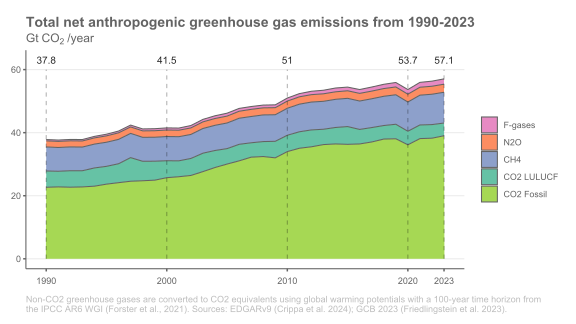
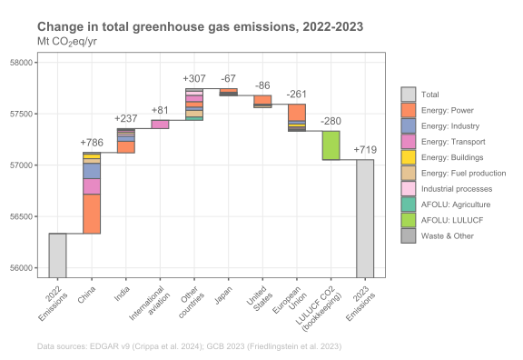

<style type="text/css">

body {
	width: 940px;
	margin: auto;
}

html {
  font-size: 14px;
}

.chart-title {  /* chart_title  */
  font-size: 16px;

.figure-title {  /* figure_title  */
  color: red;
  font-size: 20px;

img {
    max-width: 100%;
    max-height: 100%;
}

</style>


```{r setup, include=FALSE}

rm(list = ls())
library(flexdashboard)
library(tidyverse)
library(knitr)

```


Global emissions
=====================================  

### 

```{r total_figure,out.width="80%",fig.align = 'center',results='asis'}
cat("<br>")


```
```{r total_links,results = 'asis'}

cat("&nbsp;&nbsp;&nbsp;&nbsp;&nbsp;&nbsp;&nbsp;Links: ")
cat("<a target=\"_blank\" href='https://github.com/lambwf/UNEP-Gap-Report-2024-Chapter-2/raw/main/results/UNEP-Gap-Report-2024-Chapter-2-Data-Global.xlsx'>data</a>|
    <a target=\"_blank\" href='https://raw.githubusercontent.com/lambwf/UNEP-Gap-Report-2024-Chapter-2/main/results/figure_global_gases-1.png'>png</a>|
    <a target=\"_blank\" href='https://raw.githubusercontent.com/lambwf/UNEP-Gap-Report-2024-Chapter-2/main/results/figure_global_gases-1.pdf'>pdf</a>")
```


### 

```{r sector_figure,out.width="80%",fig.align = 'center',results='asis'}
cat("<br>")


```
```{r sector_links,results = 'asis'}

cat("&nbsp;&nbsp;&nbsp;&nbsp;&nbsp;&nbsp;&nbsp;Links: ")
cat("<a target=\"_blank\" href='https://github.com/lambwf/UNEP-Gap-Report-2024-Chapter-2/raw/main/results/UNEP-Gap-Report-2024-Chapter-2-Data-Global.xlsx'>data</a>|
    <a target=\"_blank\" href='https://raw.githubusercontent.com/lambwf/UNEP-Gap-Report-2024-Chapter-2/main/results/figure_global_sector_shares-1.png'>png</a>|
    <a target=\"_blank\" href='https://raw.githubusercontent.com/lambwf/UNEP-Gap-Report-2024-Chapter-2/main/results/figure_global_sector_shares-1.pdf'>pdf</a>")

```


### 

```{r change_figure,out.width="80%",fig.align = 'center',results='asis'}
cat("<br>")


```
```{r change_links,results = 'asis'}

cat("&nbsp;&nbsp;&nbsp;&nbsp;&nbsp;&nbsp;&nbsp;Links: ")
cat("<a target=\"_blank\" href='https://github.com/lambwf/UNEP-Gap-Report-2024-Chapter-2/raw/main/results/UNEP-Gap-Report-2024-Chapter-2-Data-Global.xlsx'>data</a>|
    <a target=\"_blank\" href='https://raw.githubusercontent.com/lambwf/UNEP-Gap-Report-2024-Chapter-2/main/results/figure_global_changes-1.png'>png</a>|
    <a target=\"_blank\" href='https://raw.githubusercontent.com/lambwf/UNEP-Gap-Report-2024-Chapter-2/main/results/figure_global_changes-1.pdf'>pdf</a>")

```


Top emitters
=====================================  


```{r top_emitters, echo = FALSE, eval = TRUE,results='asis'}

filenames <- c("results/countries/China.svg",
               "results/countries/United States.svg",
               "results/countries/India.svg",
               "results/countries/European Union.svg",
               "results/countries/Russia.svg",
               "results/countries/Brazil.svg")

out <- lapply(seq_along(filenames), function(i) {
  
  # Tab header, no title in tile as these are in figures
  a1 <- knitr::knit_expand(text = "### \n")
  
  # Start R chunk
  a2 <- knitr::knit_expand(text = "\n```{r, results='asis',out.width='80%',fig.align = 'center'} \n")
  #a2 <- knitr::knit_expand(text = "\n```{r, results='asis'} \n")
  
  # Render figure
  #a3 <- knitr::knit_expand(text = paste0("include_graphics('",filenames[i],"')"))
  a3  <- knitr::knit_expand(text = paste0("cat('')"))
  
  # End R chunk
  a4 <- knitr::knit_expand(text = "\n```\n")
  
  
  # Start another R chunk
  a5 <- knitr::knit_expand(text = "\n```{r, results='asis'} \n")
  
  # Include links to figure and data
  country <- sub(".*/(.*)\\.svg", "\\1", filenames[i])
  
  link_1 <- "<a target=\"_blank\" href=\"https://github.com/lambwf/UNEP-Gap-Report-2024-Chapter-2/raw/main/results/UNEP-Gap-Report-2024-Chapter-2-Data-Countries.xlsx\">data</a>"
  
  link_2 <- paste0("https://raw.githubusercontent.com/lambwf/UNEP-Gap-Report-2024-Chapter-2/main/results/countries/",country,".png")
  link_2 <- paste0("<a target=\"_blank\" href=","\"",link_2,"\"",">png</a>")

  link_3 <- paste0("https://raw.githubusercontent.com/lambwf/UNEP-Gap-Report-2024-Chapter-2/main/results/countries/",country,".pdf")
  link_3 <- paste0("<a target=\"_blank\" href=","\"",link_3,"\"",">pdf</a>")

  # Write text
  a6  <- knitr::knit_expand(text = paste0("cat('&nbsp;&nbsp;&nbsp;&nbsp;&nbsp;&nbsp;&nbsp;','",country,": ')"))
  a7  <- knitr::knit_expand(text = paste0("\ncat('",link_1,"')"))
  a8  <- knitr::knit_expand(text = paste0("\ncat('|')"))
  a9  <- knitr::knit_expand(text = paste0("\ncat('",link_2,"')"))
  a10 <- knitr::knit_expand(text = paste0("\ncat('|')"))
  a11 <- knitr::knit_expand(text = paste0("\ncat('",link_3,"')"))
  
  
  # End R chunk
  a12 <- knitr::knit_expand(text = "\n```\n")
  
  
  # Collapse together all lines with newline separator
  paste(a1, a2, a3, a5, a4, a5, a6, a7, a8, a9, a10, a11, a12, collapse = '\n') 
})


```

`r knitr::knit(text = paste(out, collapse = '\n'))`


All countries
=====================================  


```{r all_countries, echo = FALSE, eval = TRUE,results='asis'}

filenames <- list.files("results/countries/", pattern="*.svg", full.names=TRUE)
#filenames <- filenames[1:4]

out <- lapply(seq_along(filenames), function(i) {
  
  # Tab header, no title in tile as these are in figures
  a1 <- knitr::knit_expand(text = "### \n")
  
  # Start R chunk
  a2 <- knitr::knit_expand(text = "\n```{r, results='asis',out.width='80%',fig.align = 'center'} \n")
  
  # Render figure
  #a3 <- knitr::knit_expand(text = paste0("include_graphics('",filenames[i],"')"))
  a3  <- knitr::knit_expand(text = paste0("cat('' )"))
  
  # End R chunk
  a4 <- knitr::knit_expand(text = "\n```\n")
  
  
  # Start another R chunk
  a5 <- knitr::knit_expand(text = "\n```{r, results='asis'} \n")
  
  # Include links to figure and data
  country <- sub(".*/(.*)\\.svg", "\\1", filenames[i])
  
  link_1 <- "<a target=\"_blank\" href=\"https://github.com/lambwf/UNEP-Gap-Report-2024-Chapter-2/raw/main/results/UNEP-Gap-Report-2024-Chapter-2-Data-Countries.xlsx\">data</a>"
  
  link_2 <- paste0("https://raw.githubusercontent.com/lambwf/UNEP-Gap-Report-2024-Chapter-2/main/results/countries/",country,".png")
  link_2 <- paste0("<a target=\"_blank\" href=","\"",link_2,"\"",">png</a>")

  link_3 <- paste0("https://raw.githubusercontent.com/lambwf/UNEP-Gap-Report-2024-Chapter-2/main/results/countries/",country,".pdf")
  link_3 <- paste0("<a target=\"_blank\" href=","\"",link_3,"\"",">pdf</a>")

  
  # Write text
  a6  <- knitr::knit_expand(text = paste0("cat('&nbsp;&nbsp;&nbsp;&nbsp;&nbsp;&nbsp;&nbsp;','",country,": ')"))
  a7  <- knitr::knit_expand(text = paste0("\ncat('",link_1,"')"))
  a8  <- knitr::knit_expand(text = paste0("\ncat('|')"))
  a9  <- knitr::knit_expand(text = paste0("\ncat('",link_2,"')"))
  a10 <- knitr::knit_expand(text = paste0("\ncat('|')"))
  a11 <- knitr::knit_expand(text = paste0("\ncat('",link_3,"')"))
  
  
  # End R chunk
  a12 <- knitr::knit_expand(text = "\n```\n")
  
  
  # Collapse together all lines with newline separator
  paste(a1, a2, a3, a5, a4, a5, a6, a7, a8, a9, a10, a11, a12, collapse = '\n') 
})


```

`r knitr::knit(text = paste(out, collapse = '\n'))`


Info
=====================================


### Authors

Figures and analysis are produced by <a href="https://www.mcc-berlin.net/en/about/team/lamb-william.html">William F. Lamb</a> with support from:

* Minal Pathak
* Monica Crippa
* Diego Guizzardi
* Giacomo Grassi
* Glen P. Peters
* Julia Pongratz


### Data sources

The following underlying sources are used to produce all figures:

* The EDGAR v8.0 database of greenhouse gas emissions (<a href="https://edgar.jrc.ec.europa.eu/dataset_ghg80">Crippa et al. 2024</a>)
* The Global Carbon Budget database of historic CO2 emissions (<a href="https://globalcarbonbudget.org/carbonbudget2023/">Friedlingstein et al. 2023</a>)
* The National GHG Inventory Database of CO2 LULUCF emissions (<a href="https://zenodo.org/records/7190601">Grassi et al. 2024</a>)
* The UNFCCC National Inventory Submissions (<a href="https://unfccc.int/ghg-inventories-annex-i-parties/2023">UNFCCC 2024</a>)

Emissions are grouped into common sectors based on <a href="https://github.com/lambwf/UNEP-Gap-Report-2024-Chapter-2/raw/main/sources/cc_sectors.xlsx">this</a> scheme. We use global warming potentials with a time horizon of 100 years (GWP100) from the <a href="https://github.com/openclimatedata/globalwarmingpotentials">IPCC AR6</a> to aggregate greenhouse gas emissions.


